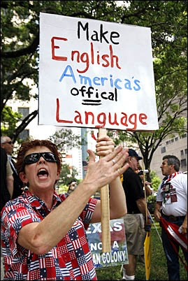
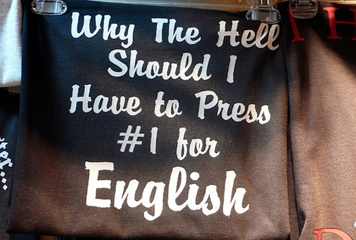
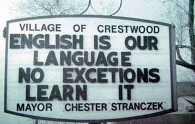
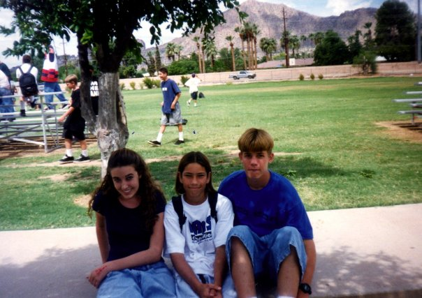

```{r setup, include=FALSE}
options(htmltools.dir.version = FALSE)
```

```{r eval=FALSE, echo=FALSE}
rmarkdown::render("./static/slides/02_use/index.Rmd")
xaringan::inf_mr()
```

# Outline

|  #  |  Día   | Fecha |                                    Tema                                    |             Lectura              |
| :-- | :----- | :---: | :------------------------------------------------------------------------- | :------------------------------- |
| 06  | Lunes  | 09/25 | Metodología 1: R, RMarkdown y la investigación reproducible.               |                                  |
| 07  | Jueves | 09/28 | Lengua y sociedad.                                                         | LA: cap. 8, p. 180-193           |
| 08  | Lunes  | 10/02 | Lengua y sociedad.                                                         | LA: cap. 8, p. 194-198, 202-204. |
| 09  | Jueves | 10/05 | Los pronombres. Pres 2a.                                                   | LA: cap. 3, p. 53-59.            |
| 10  | Lunes  | 10/09 | Expresión de pronombre sujeto en el español de EE.UU. Pres 2b.             | ART: Flores-Ferrán (2004)        |
| 11  | Jueves | 10/12 | Sociolingüística: contacto y variación. Presentación del Dr. Ryan Bessett. |                                  |

---
background-image: url("./assets/img/science.jpg")
background-size: 325px
background-position: 100% 50%
class: inverse, middle

# Metodología 1:

## R, RMarkdown y la investigación reproducible

---

# La investigación reproducible

- ¿Qué?

- ¿Por qué?

- ¿Cómo?

--

</br>

- ¿Por qué creéis que es importante que se hagan investigaciones científicas?
- ¿Cuál es tu experiencia con la investigación?
- Con un/a compañer@, considerad la idea de 'investigación reproducible'. ¿Qué 
pensáis que significa? Dad una definición. 

---
background-image: url(https://static1.squarespace.com/static/4f5694c424aca8d4f8e69194/t/531b874ce4b0c39be0c9fa07/1394313616262/Miracle+Occurs+Image)
background-size: 350px
background-position: 98% 50%
class: inverse

# La investigación reproducible - ¿qué?

## **Una definición**

### La noción de *investigación reproducible* parte del principio de que 
### el análisis de datos y, de manera más general, las afirmaciones 
### científicas deben publicarse junto con los datos y el software usados 
### para producirlos, de ahí que la comunidad científica pueda 
### verificar/replicar los hallazgos y basarse en ellos para futuras 
### investigaciones.

---
class: inverse

.pull-left[
<iframe width="560" height="315" src="https://www.youtube.com/embed/tW-KMJdkj-4?rel=0" frameborder="0" allowfullscreen></iframe>
]

.pull-right[
<iframe width="560" height="315" src="https://www.youtube.com/embed/2oyhlad64-s?rel=0" frameborder="0" allowfullscreen></iframe>
]

---
background-image: url(http://fileserver.freehandmusic.netdna-cdn.com/preview/530x4/emi/emimfborhap.png)
background-size: 325px
background-position: 95% 50%
class: inverse, middle 

.big[
- Queremos escribir la **partitura** de nuestro  
análisis de datos para comunicar a los demás  
lo que hicimos
]

--

.big[
- Si los demás quieren, pueden reproducir  
nuestro trabajo
]

--

.big[
- El problema principal es que no tenemos  
una **partitura estándar**
]

--

.big[
- Todo el mundo lo hace a su manera y es  
un lío
]

--

.big[
- A veces describir bien la metodología  
basta... En la mayoría de los casos no  
es suficiente
]

---

# La investigación reproducible - ¿qué?

### Una definición


>La noción de *investigación reproducible* parte del principio de que 
>el análisis de datos y, de manera más general, las afirmaciones 
>científicas deben publicarse junto con los datos y el software usados 
>para producirlos, de ahí que la comunidad científica pueda 
>verificar/replicar los hallazgos y basarse en ellos para futuras 
>investigaciones.


--

### Más detalles

- La metodología debe reportarse completamente (común)
--

- Los datos originales tienen que estar disponibles
--

- El código (script) usado para llevar a cabo el análisis tiene
que estar disponible
--

- Un investigador independiente debería poder usar los datos y el 
código para obtener los mismos resultados

--

1. ¿Por qué es importante que se hagan réplicas de los experimentos?
2. ¿Cuáles son las razones por las cuales un investigador debe hacer 
investigaciones reproducibles?
3. ¿Alguna razón por la que no debiera?

---

# La investigación reproducible - ¿por qué?

### Reproducible ≠ correcto

- Una investigación puede ser reproducible y las conclusiones erróneas  
Ej. La tarea producir cáncer

- Si mi hallazgo tiene algún valor, alguien intentará replicarlo 

- Las afirmaciones de mi estudio se aceptan cuando otros investigadores 
llegan a la misma conclusión

- Si no, se rechazan y la vida continúa

--

### Es lo único que podemos garantizar

- No podemos garantizar que nuestros hallazgos sean correctos

- Pero sí podemos preocuparnos de que la investigación sea reproducible 

- Esto asegura la transparencia y nos da la certeza de haber entendido 
exactamente lo que se ha hecho.

---
background-image: url(https://d2ufo47lrtsv5s.cloudfront.net/content/sci/334/6060/1226/F1.large.jpg)
background-position: 50% 50%
background-size: 1000px

# La investigación reproducible - ¿cómo?

---
background-image: url(http://1.bp.blogspot.com/-oyAa5Y5KjDM/UNyq19wgmWI/AAAAAAAAB3U/hhbZtNfYCFo/s1600/writeshitdown.jpg)
background-position: 100% 50%
background-size: 450px

# La investigación reproducible - ¿cómo?

--

- "You from six months from now won't remember what you  
did or why"

- Se debe documentar los pasos seguidos para producir  
los resultados

- En general esto significa incluir comentarios en el script

--

.footnote[
**Mejor todavía, creamos un documento dinámico que contenga todo**
]

---
background-image: url(http://rmarkdown.rstudio.com/articles/images/rmdint-template.png)
background-size: contain

---
background-image: url(http://rmarkdown.rstudio.com/images/RMarkdownOutputFormats.png)
background-position: 98% 50%
background-size: 450px

# La investigación reproducible - ¿cómo?

### R

- Un lenguaje de programación que sirve para hacer estadística
- Gratis y disponible en cualquier plataforma

### Markdown

- Un lenguaje de marcado
- Se usa mucho en los blogs
- Se escribe con texto simple para generar HTML

--

### RMarkdown

- Combina R y Markdown en un mismo documento
- Nos permite evitar word 😁
- Se escribe en un archivo de texto simple (.Rmd) para 
generar el output deseado

---

# Probemos

- Abrid RStudio

- Tutorial disponible [aquí](http://www.jvcasillas.com/420_01_f2017/docs/tools/rmd_tutorial.html)

---


class: inverse, center, middle

<!-- Thursday, sept 28 -->

# Lengua y sociedad

---

# Lengua y sociedad

### Precalentamiento

- Normalmente, cuando una nación conquista a otra, trata de imponer su lengua en el pueblo conquistado. ¿Cuáles son las razones para ello? ¿Cuáles son las posibles consecuencias? Dé ejemplos de dicha política que Ud. conozca. 

- Hay relaciones entre el poder y la lengua. Describe esta relación. ¿En qué otras áreas se ve manifestada?

- ¿Cuál es la diferencia entre lengua y dialecto?

- ¿Qué es la estandarización/un estándar? ¿Por qué es importante?

- ¿Qué es una comunidad de habla? ¿Perteneces a una? ¿Cuál? ¿Es diferente para tu L2/L3?

---

# Diferencias regionales

### En grupos de 3, escoged una de las siguientes opciones y prepara una mini presentación (2 o 3 minutos) en la que aportéis un resumen general con ejemplos (del texto y vuestra experiencia).

- El seseo
- La aspiración 
- La neutralización de líquidas
- Diferencias gramaticales
- Diferencias léxicas

---


<!-- mon oct 2nd -->

# La estratificación social

### Estratificación dentro de una región geográfica

- La edad

- La clase social

- El género

- La formación académica

--

.footnote[Sociolecto = dialecto social]

---

# La estratificación social

<div style="float:right">

```{r 'agePlot', fig.retina=2, fig.width=8, fig.height=6, warning=FALSE, message=FALSE, echo=FALSE}
library(tidyverse)
tribble(
  ~`edad`, ~`perc`, 
        1,   20, 
        2,   25, 
        3,   85, 
        4,   90
) %>% 
  ggplot(., aes(x = edad, y = perc)) + 
    geom_line(size = 2) + 
    scale_y_continuous(breaks = seq(0, 100, 20), limits = c(0, 100), 
                       labels = c('0%', '20%', '40%', '60%', '80%', '100%')) + 
    scale_x_continuous(breaks = seq(1, 4, 1), 
                       labels = c('61+', '41-60', '26-40', '13-25'), 
                       limits = c(0.5, 4.5)) + 
    labs(x = 'Edad', y = '%', 
         title = 'Correlación entre la variante\ndeslateralizada y la edad en Covarrubias') + 
    theme_grey(base_family = 'Times', base_size = 24)
```

</div>

### Edad

- A medida que pasa el tiempo las lenguas cambian

- Este proceso es inevitable (si no, todavía hablaríamos latín)

- Por esta razón solemos poder ver diferencias lingüísticas entre generaciones

--

### Preguntas

- Buscad ejemplos de variación entre tu generación y la de...
	- vuestros padres
	- vuestros abuelos
	- vuestro profesor

---

# La estratificación social

### La clase social

.pull-left[

- ¿Qué generalizaciones podemos sacar de la tabla?

- Dad ejemplos de variación (fonética, sintáctica, etc.) que esté condicionada por la clase 
social. 

]

.pull-right[

| **Clase**  | [s] | [h] | [⦸] |
| :--------- | :-: | :-: | :-: |
| alta       | 26% | 37% | 37% |
| media-alta | 19% | 38% | 43% |
| media      | 22% | 34% | 44% |
| media-baja | 16% | 33% | 51% |
| baja       | 17% | 36% | 48% |

]

---
class: middle

```{r 'classPlot', fig.retina=2, fig.width=14, fig.height=8, warning=FALSE, message=FALSE, echo=FALSE, fig.align='center'}
library(viridis)
tribble(
~`clase`, ~`[s]`, ~`[h]`, ~`[-]`,
'alta'      , 26, 37, 37,
'media-alta', 19, 38, 43,
'media'     , 22, 34, 44,
'media-baja', 16, 33, 51,
'baja'      , 17, 36, 48) %>% 
  gather(., key = phon, value = percent, -clase) %>% 
  mutate(., clase = factor(clase, 
                            levels = c('baja', 
                                       'media-baja', 
                                       'media', 
                                       'media-alta', 
                                       'alta')), 
            phon = factor(phon, levels = c('[s]', '[h]', '[-]'))) %>%
  ggplot(., aes(x = clase, y = percent)) + 
    geom_bar(aes(fill = phon), stat = 'identity', position = 'dodge') + 
    ylim(0, 100) + 
    scale_fill_viridis(discrete = TRUE) + 
    labs(x = 'Clase social', y = '%') + 
    theme_minimal(base_family = 'Times', base_size = 24)

```

---

# La estratificación social

### El género

- La pronunciación de la mujer suele ser más cuidadosa

- Evitan las formas estigmatizadas

- Las mujeres suelen liderar los cambios lingüísticos

--

### Preguntas

- ¿Se os ocurren otras diferencias entre el habla femenina y masculina en español o inglés? ¿A qué nivel lingüístico se hallan: fonológico, morfológico, sintáctico, léxico, pragmático, no verbal? Dad ejemplos específicos. ¿A qué se deben estas diferencias? 

- ¿Es una contradicción decir que las mujeres suelen hablar de forma más cuidadosa, pero al mismo tiempo afirmar que son ellas las que lideran el cambio lingüístico? ¿Cómo se explica?

---

# La estratificación social

### La formación académica

- Cuanto más instrucción, más uso de las variantes prestigiosas

- También está correlacionada con la profesión, la clase social y el estatus

--

### Preguntas

- Dad ejemplos concretos en inglés y español de variación relacionada con la formación académica 

---

# Contextos bilingües 

### Diglosia

--

- En un contexto bilingüe se dice que hay diglosia si las dos lenguas 
cumplen funciones diferentes en una comunidad de habla (Fishman, 1968)

--

|                |                  | Diglosia |                |
| :------------- | :--------------: | :------: | :------------: |
|                |  <blue>+</blue>  |          | **-**          | 
|                |  Diglosia        |          | Bilingüismo    |
| <blue>+</blue> |  y bilingüismo   |          | sin diglosia   |
|                |  &nbsp;          |          |                |
|                |  Diglosia        |          | Ni bilingüismo |
| **-**          |  sin bilingüismo |          | ni diglosia    |


--

</br>

1. ¿Qué quiere decir "funciones diferentes"? Aportad ejemplos. 
2. Pensad en un ejemplo de cada una de las posibilidades aportadas arriba. Según Fishman, en cuál de las situaciones se mantiene el bilingüismo y en cuál se pierde?
3. ¿Hay diglosia en NJ? Defended vuestra respuesta. 

---
background-image: url("http://cdn.history.com/sites/2/2013/12/new-york-city-H.jpeg")
background-size: contain

.big[**53 millones** de hispanos]

???

- Sabemos que la población hispana está en auge en este país

- Tenemos datos de los últimos 50 años que demuestran el crecimiento que se ha visto

- Actualmente hay más de 50 millones de hispanos en EEUU y los pronósticos dice que va a haber aún más en los próximos 40 años

---
background-image: url("./assets/img/spanish_at_home.png")
background-size: contain

???

- Un alto porcentaje de familias hablan español en la casa

- Cuanto más oscuro, más alto el porcentaje de familias que hablan español en casa

- Pero a veces se nos olvida, o simplemente ignoramos el hecho de que el español y la comunidad hispana han estado aquí desde el principio (de este país)

- Como ejemplo de ello, voy a hablar brevemente de una comunidad en el suroeste de estados unidades, Nogales, Arizona

---
class: middle, center

# <grey>Arizona</grey>

.big[**Nogales**]

# <grey>Sonora</grey>


---
background-image: url("./assets/img/us.png")
background-size: contain
background-color: #A2CCFF

---
background-image: url("./assets/img/nogales0.png")
background-size: contain

---
background-image: url("./assets/img/nogales1.png")
background-size: contain
class: inverse

???

- 20 mil habitantes

- 95% de los cuales son hispanos

---
background-image: url("./assets/img/nogales4.png")
background-size: contain
class: inverse

???

- Prácticamente todo el mundo es bilingüe (se estima un 60%)

- Pero hay monolingües en español (20%), monolingües en inglés

---
background-image: url("./assets/img/nogales2.png")
background-size: contain
class: inverse

???

- Hay contacto constante

---
background-image: url("./assets/img/mexican_Cession.png")
background-size: contain
class: inverse

???

- Generaciones de familias que han vivido en esta zona 

- No cruzaron ninguna frontera

- Arizona se convierte en el estado 48 en el año 1912

- No sólo ocurre en AZ
	- CA, NM, TX
	- PR

- Entonces podemos preguntarnos ¿cómo es el bilingüismo en nuestro país?

---
class: center, middle

# <grey>El bilingüismo en EE.UU.</grey>

---

```{r, echo=FALSE, fig.width=13, fig.height=8.5, fig.retina=2, warning=FALSE, message=FALSE, cache=TRUE}
language <- c("Español", "Mandarín", "Francés", 
  "Tagalog", "Vietnamita", "Koreano", "Alemán", "Árabe", "Ruso", "Italiano", 
  "Portugués", "Hindi", "Polaco", "Todas las\ndemás")
numSpeakers <- c(37579787, 2882497, 2055433, 1594413, 1419539, 1141227, 1083637, 
  951699, 905843, 723632, 673566, 648983, 607403, 8309361)
df_hl_totals <- data.frame(language, numSpeakers)
df_hl_totals$language <- factor(df_hl_totals$language, levels = df_hl_totals$language[order(c(14, 13:1))])

library(tidyverse); library(plotly)
p1 <- ggplot(df_hl_totals, 
     aes(x = (numSpeakers/1000000), 
       y = language, 
         label = paste0(round((numSpeakers/1000000), 1), "m"))) + 
  geom_segment(aes(x = 0, y = language, xend = (numSpeakers/1000000), 
                   yend = language), color = "grey40", lwd = 3.25) +
  geom_point(size = 19, color = 'lightblue') + 
  geom_text(color = "black", size = 5) +
  scale_x_log10(breaks = c(0, 1, 10, 40)) + 
  ylab("") + xlab("Número de hablantes (en millones)") + 
  #theme(axis.text = element_text(colour = "black")) +
  theme_minimal(base_size = 30, base_family = "Times")
print(p1)
```

???

- Hay más hablantes de español que de cualquier otra lengua

---
background-image: url("./assets/img/bilingualCont.png")
background-size: contain

.center[
# Continuo bilingüe
]

.footnote[<grey>Valdés (2001)</grey>]

--

</br></br></br></br></br></br></br>

<div align='center'>
  
  
</div>

<!-- Mantenimiento y cambio lingüístico -->

???

- En los extremos tenemos monolingües en lengua A o B

- Entre los extremos tenemos bilingües de distintos niveles de prof.

---
background-image: url("./assets/img/shift_happens.png")
background-size: 200px
background-position: 90% 50%
class: middle

.big[Cambio a la lengua  
.jumbo[&nbsp; <grey>mayoritaria</grey>] 
### &nbsp; &nbsp; &nbsp; &nbsp; &nbsp; &nbsp; &nbsp; &nbsp; &nbsp; &nbsp; &nbsp; &nbsp; en tan sólo  
.jumbo[**3 generaciones**]
]

???

- En zonas de contacto, donde hay bilingüismo, las lenguas cambian

- El español de EEUU es diferente en cuanto al léxico, la sintaxis, la morfología y la fonología. Es natural, inevitable. 

- Hay muchos hablantes de herencia, personas que hablan una lengua en casa, la lengua de su familia, y el inglés fuera de la casa

- generalmente tenemos la primera gen. que es monolingüe en español

- después sus hijos, la 2a gen., suele ser bilingüe

- los hijos de la 2a gen., la 3a gen., en muchos casos es monolingüe en inglés

- A veces este cambio puede ocurrir en la 2a gen.!

- En muchas universidades existen programas especiales para estas personas, programa para hablantes de herencia, y estamos haciendo muchos esfuerzos para que el español se mantenga, pero la realidad es que...

---
class: middle

# <grey>La política lingüística</grey>  

.center[
.big[
**DESFAVORECE**
]
]

.pull-right[
# &nbsp; &nbsp; &nbsp; &nbsp; &nbsp; &nbsp; &nbsp; &nbsp; <grey>el multilingüismo</grey>
]

???

- Hemos visto que en eeuu se hablan muchas lenguas

- Aún así EEUU se tiene como una nación monolingüe

- políticas lingüísticas pensadas para dañar, para la asimilación
	- Larga historia, algunos ejemplos
	- English first
	- IMS

---

# Sólo inglés

<div align="center">
  
  
  
</div>

---

# Sólo inglés

<div align="center">
  
  
</div>

---

# Sólo inglés

.pull-left[

- En 2003 en la escuela secundaria Ingleside en Phoenix, Arizona, 8 niños reportaron que su maestro les había pegado por hablar español en clase
- Comentaron que tenían moratones en los brazos
- Despidieron al maestro en el 2004.

]

--

.pull-right[

<div>
  
  Ingleside (1995)
</div>

]

</br>

**En resumidas cuentas**: no animamos a los inmigrantes ni a nuestros propios bilingües a que mantengan sus lenguas y tampoco aprendemos otras L2

.footnote[
[www.azbilingualed.org](http://www.azbilingualed.org/AABE%20Site/AABE--News%202004/teacher_faces_firing_for_hitting.htm)
]

???

- We might think this is something of the past... not the case.

---
background-image: url("./assets/img/english_only7.png"), url("./assets/img/english_only6.png")
background-size: 400px, 400px
background-position: 15% 50%, 85% 50%

---
background-image: url("./assets/img/english_only8.png")
background-size: contain

---
background-image: url("./assets/img/futuro.png")
background-size: 700px
background-position: 100% 50%
class: inverse, middle

# Hacia el futuro

???

- Podemos generar modelos para prever como va a seguir creciendo la población hispana durante los próximos 50 años y llegamos a una clara conclusión: el futuro de este país es moreno

---

```{r, echo=FALSE, fig.width=14, fig.height=8, fig.retina=2, warning=FALSE, message=FALSE, cache=TRUE}
df_census <- read.csv("./assets/data/NP2014_D1.csv", header = TRUE, quote = "")

df_census_projected <- df_census %>%
  filter(., origin == "2" & race == "0" & sex == "0") %>%
  select(., year, population = total_pop) %>%
  mutate(., population = population/1000000)

df_census_projected$Data <- "Esperado"

year <- c(1970, 1980, 1990, 2000, 2010, 2014)
population <- c(9.6, 14.5, 22.6, 35.7, 50.8, 55.4)

df_census_old <- data.frame(year, population, Data = "Observado")
df_census <- rbind(df_census_old, df_census_projected)

p3 <- df_census %>%
  filter(., Data == "Observado") %>%
  ggplot(., aes(x = year, y = population)) + 
  geom_line(color = 'black', size = 2) + 
  geom_point(size = 5, color = 'red') + 
  ylab("Población hispana") + 
  xlab("Año") + 
  labs(title = "Población hispana desde 1970") + 
  theme_bw(base_size = 20, base_family = "Times")
ggplotly(p3)
```

.footnote[
[Pew Research Center](http://www.pewresearch.org/fact-tank/2015/06/25/u-s-hispanic-population-growth-surge-cools/)
]


---

#### Niños hispanos (% desde 2000)

.pull-left[

```{r, echo=FALSE, fig.retina=2, cache=TRUE, eval=TRUE, message=FALSE}

df_child_pop <- read_csv("./assets/data/child_pop_race.csv")

df_child_pop %>% 
  filter(., Race == "Hispanic or Latino" & 
            DataFormat == 'Percent' & 
            Location != "United States") %>%
  ggplot(., aes(x = TimeFrame, y = as.numeric(Data) * 100)) + 
    stat_summary(fun.data = mean_se, geom = "pointrange", size = 1) + 
    stat_summary(fun.y = mean, geom = "point", color = 'red', size = 2.25) +
    ylab("% niños hispanos") + 
    xlab("Año") + 
    coord_cartesian(ylim = c(0, 30)) + 
    labs(title = "EE.UU.") + 
    theme_bw(base_size = 24, base_family = "Times")
```
]

--

.pull-right[

```{r, echo=FALSE, fig.retina=2, cache=TRUE, eval=TRUE}
df_child_pop %>% 
  filter(., Race == "Hispanic or Latino" & 
            DataFormat == 'Percent' & 
            Location == "New Jersey") %>%
  ggplot(., aes(x = TimeFrame, y = as.numeric(Data) * 100)) + 
    stat_summary(fun.y = mean, geom = "line", size = 2) +
    geom_point(color = 'blue', size = 3) + 
    ylab("% niños hispanos") + 
    xlab("Año") + 
    ylim(0, 30) + 
    labs(title = "Nueva Jersey") + 
    theme_bw(base_size = 24, base_family = "Times")
```

]

.footnote[http://datacenter.kidscount.org]

---

```{r, echo=FALSE, fig.width=14, fig.height=8.5, fig.retina=2, warning=FALSE, message=FALSE, cache=TRUE}
df_census %>%
  ggplot(., aes(x = year, y = population, color = Data)) + 
  geom_line(color = 'black', size = 1) + 
  geom_point(size = 4.5) + 
  geom_point(size = 2.5, color = "black") + 
  ylim(0, 130) + 
  scale_color_brewer(palette = "Set1", name = NULL) + 
  ylab("Población hispana") + 
  xlab("Año") + 
  theme_bw(base_size = 28, base_family = "Times") +
  theme(legend.position = c(0.1, 0.9)) 
```

???

- la comunidad hispana y el español siempre han formado parte de nuestro país

- eso no va a parar, todo lo contrario

- ahora vosotros formáis parte de nuestra comunidad hispanohablante

- bienvenidos al club

---
# Contextos bilingües

### Alternancia de código

<iframe width="560" height="315" src="https://www.youtube.com/embed/re-k5m0OsTY?rel=0" frameborder="0" allowfullscreen></iframe>

---

# Contextos bilingües

### Alternancia de código

<iframe width="560" height="315" src="https://www.youtube.com/embed/tPZfTBYrzAc?rel=0&amp;start=90" frameborder="0" allowfullscreen></iframe>

---

# Contextos bilingües

### Alternancia de código

<iframe width="560" height="315" src="https://www.youtube.com/embed/nYMnNlfSMC0?rel=0" frameborder="0" allowfullscreen></iframe>

---

# Contextos bilingües

### Simplificación y pérdida

- En bilingües es común que haya simplificación y/o pérdida de ciertas construcciones

- El trabajo de Silva-Corvalán (1994) examina el español de tres generaciones de hispanohablantes que viven en LA, California

- Clasifica a los bilingües en 3 grupos
	- Grupo 1 (primera generación): nacidos en Mex., llegan a EE.UU. después de los 11 años
	- Grupo 2: nacidos en EE.UU. o en Mex. (pero llegan antes de los 6 años)
	- Grupo 3: nacidos en EE.UU., uno de los padres pertenece al grupo 2

- Descubre que hay simplificación/pérdida del sistema verbal español que ocurre en etapas distintas

---

#### <blue>Simplificación</blue> y **pérdida**

.left-column[

- ¿Qué generalizaciones podemos sacar de la tabla?

- ¿En qué grupo se ve más afectado el sistema verbal español?

]

.right-column[

|                 |                                                         |             |
| :-------------- | :------------------------------------------------------ | ----------: |
| **P**:          | Futuro perfecto, condicional                            | Grupo 1     |
| &nbsp;          |                                                         |             |
| **P**:          | Condicional perfecto, pretérito perfecto del subjuntivo | Grupos 1, 2 | 
| <blue>S</blue>: | Futuro, infinitivo perfecto                             |             |
| &nbsp;          |                                                         |             |
| **P**:          | Futuro, infinitivo perfecto                             | Grupos 2, 3 |
| <blue>S</blue>: | Pluscuamperfecto del subjuntivo, pluscuamperfecto del   |             | 
|                 | indicativo, Imperfecto del subjuntivo, pretérito con    |             | 
|                 | verbos estativos, imperfecto                            |             |
| &nbsp;          |                                                         |             |
| **P**:          | Pluscuamperfecto del subjuntivo, pluscuamperfecto del   | Grupos 2, 3 | 
|                 | indicativo                                              |             |
| <blue>S</blue>: | Presente del subjuntivo                                 |             | 
| &nbsp;          |                                                         |             |
| **P**:          | Imperfecto del subjuntivo, condicional (función modal)  | Grupo 3     |
| <blue>S</blue>: | Pretérito perfecto del indicativo                       |             |
| &nbsp;          |                                                         |             |
| **P**:          | Pretérito perfecto del indicativo                       | Grupo 3     |
| <blue>S</blue>: | Imperativo                                              |             |
| &nbsp;          |                                                         |             |
| **P**:          | Presente del subjuntivo                                 | Grupo 3     |

]

---

# Presentación del jueves - Dr. Ryan Bessett

### Intereses

- la variación lingüística
- el cambio lingüístico
- el español en contacto con otras lenguas
- el bilingüismo

### Investigación principal 

- Dr. Bessett investiga el español hablado cerca de la frontera EEUU/México (como Nogales)
- Utiliza una metodología variacionista
- Le interesa separar **el cambio lingüístico que se debe al contacto** de <blue>la variación interna</blue> que ocurre en las lenguas como proceso natural
- Lo hace comparando monolingües y bilingües de EEUU y México

--

### En grupos de 2/3, pensad en preguntas para Dr. Bessett
