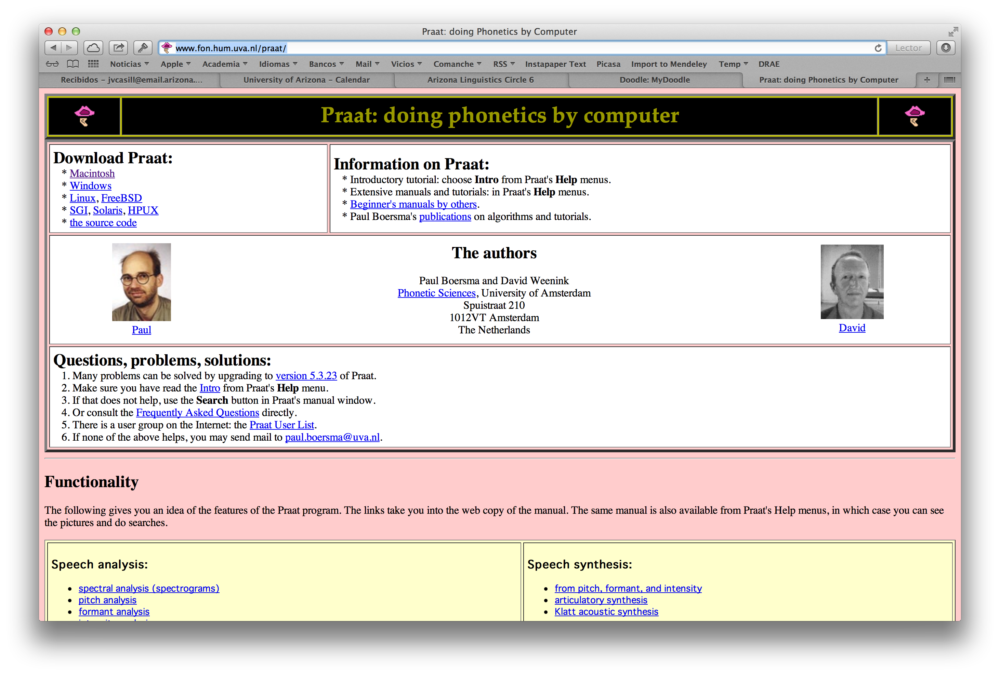
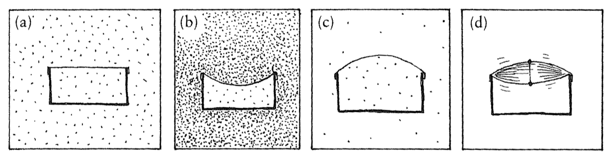
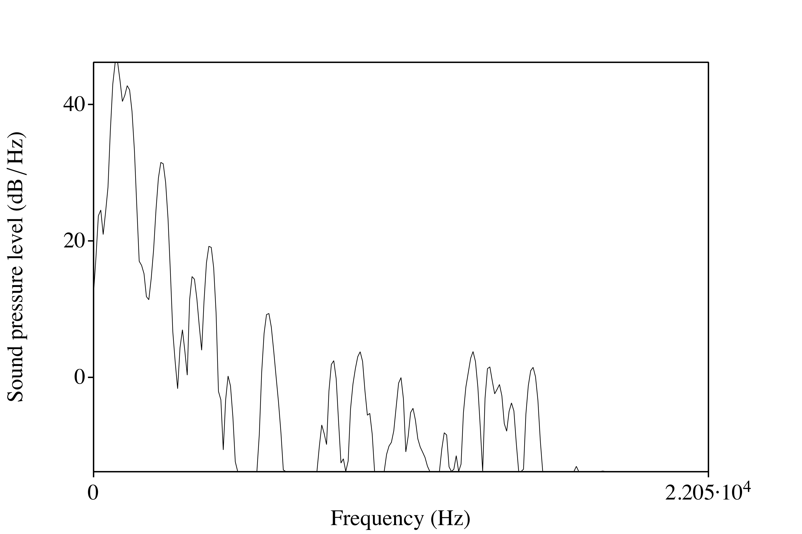

```{r setup, include=FALSE}
options(htmltools.dir.version = FALSE)
knitr::opts_chunk$set(
  echo = F, 
  fig.retina = 2, 
  message = F, 
  warning = F
  )

my_colors <- viridis::viridis(6, option = "C", begin = 0.2, end = 0.9)

library("dplyr")
library("tidyr")
library("readr")
library("purrr")
library("forcats")
library("ggplot2")
library("ggthemes")
library("ggdark")
library("here")
library("fs")
library("lingStuff")
library("untidydata")

```

```{r xaringan-extra-all-the-things, echo=FALSE}
xaringanExtra::use_xaringan_extra(
  c("tile_view", "panelset", "editable", 
    "animate", "tachyons")
)
```

# Outline

.small[

| Sesión |  Día      | Fecha |                          Tema                         |         Lectura                      |
| :----- | :-------- | :---: | :---------------------------------------------------- | :----------------------------------- |
| 12     | Lunes     | 02/28 | Metodología 2: Praat                                  |                                      |
| 13     | Miércoles | 03/02 | Adquisición secuencial.                               | PB: cap. 7, 145-155                  |
| 14     | Lunes     | 03/07 | Adquisición secuencial.                               | PB: cap. 7, 155-164.                 |
| 15     | Miércoles | 03/09 | Adquisición secuencial - producción. Pres 3a.         | Art: Knightly et al. (2003).         |
|        |           |       |                                                       |                                      |
|        |           | 03/12 | **Spring break**                                      |                                      |
|        |           |       |                                                       |                                      |
| 16     | Lunes     | 03/21 | Adquisición secuencial - percepción. Pres 3b.         | Art: Pallier et al. (1997).          |
| 17     | Miércoles | 03/23 | Presentación de investigador invitado (3) TBA         | [Blog][1] - Grosjean                 |

]

---
background-image: url("./assets/img/science.jpg")
background-size: 325px
background-position: 100% 50%
class: inverse, middle

# Metodología 2:

## El análisis acústico en Praat

---
background-image: url("./assets/img/cadena_hablada.png")
background-size: contain

---
background-image: url("./assets/img/cadena_hablada2.png")
background-size: contain

---

# La señal acústica

- Utilizamos los articuladores (activos, pasivos) para manipular el aire que expiramos 
- Estas manipulaciones afectan la estructura de la onda sonora 
  - la energía 
  - la frecuencia (la frecuencia fundamental, F0) 
  - los formantes 
  
- Podemos estudiar la estructura de la onda sonora en el ordenador con programas como Praat.

---

# Praat

http://www.fon.hum.uva.nl/praat/

<div align="center">
  
</div>

---
background-image: url("./assets/img/dospatas1.png")
background-size: contain

---
background-image: url("./assets/img/dospatas2.png")
background-size: contain

---
background-image: url("./assets/img/dospatas3.png")
background-size: contain

---
background-image: url("./assets/img/dospatas4.png")
background-size: contain

---
background-image: url("./assets/img/dospatas1.png")
background-size: 550px
background-position: 70% 70%

# Conceptos básicos

.left-column[
- **tiempo**:
- **sonido**:
- **onda sonora**:
- **presión/amplitud**:
- **frecuencia**:
- **formante**:
]

.right-column[
- Existen algunos conceptos que debemos conocer.
]

---
background-image: url("./assets/img/iii.png")
background-size: 550px
background-position: 70% 70%

# Conceptos básicos

.left-column[
- **tiempo**:
- sonido:
- onda sonora:
- presión/amplitud:
- frecuencia:
- formante:
]

.right-column[
- Magnitud física que permite ordenar la secuencia de los sucesos (y medirlos).
]

---

# Conceptos básicos

.left-column[
- tiempo:
- **sonido**:
- onda sonora:
- presión/amplitud:
- frecuencia:
- formante:
]

.right-column[
- Se refiere a la energía que pasa por el aire (u otro medio) que puede oírse.
- Físicamente es una onda longitudinal que vibra, causando compresión y 
rarefacción de las partículas del aire (moléculas).
]

---

# Conceptos básicos

.left-column[
- tiempo:
- sonido:
- **onda sonora**:
- presión/amplitud:
- frecuencia:
- formante:
]

.right-column[
- Energía acústica compuesta por rápidos cambios en la presión del aire.
- Estos cambios se propagan como olas en un estanque y se transmiten entre una 
fuente de sonido y un receptor.
]

---
background-image: url("./assets/img/pressure1.png")
background-size: contain

---
background-image: url("./assets/img/pressure2.png")
background-size: contain

---
background-image: url("./assets/img/pressure3.png")
background-size: contain

---
background-image: url("./assets/img/pressure4.png")
background-size: contain

---
background-image: url("./assets/img/pressure5.gif")
background-size: contain

---
background-image: url("./assets/img/pressure6.gif")
background-size: contain

---
background-image: url("./assets/img/pressure7.gif")
background-size: contain

---

# Conceptos básicos

.left-column[
- tiempo:
- sonido: 
- onda sonora:
- **presión**/**amplitud**:
- frecuencia:
- formante:
]

.right-column[

<div align="center">
  
</div>
- La onda sonora percibida por el oido humano consiste en fluctuaciones en la 
presión atmosférica.
- Muestra la cantidad de energía o intensidad a cada momento.

]

---
background-image: url("./assets/img/amplitude1.png")
background-size: contain
background-position: 50% 20%
class: bottom

- La amplitud es el desplazamiento vertical de la onda sonora con respecto a la 
presión normal del aire (la línea 0). 
- Un aumento de presión se corresponde con un aumento de energía/intensidad (por 
encima de la línea 0).
- Una disminución de presión se corresponde con una disminución de energía/intensidad 
(por debajo de la línea 0).

---
background-image: url("./assets/img/amplitude3.gif")
background-size: contain

---
class: center, middle

<iframe width="560" height="315" src="https://www.youtube.com/embed/INqfM1kdfUc" frameborder="0" allowfullscreen></iframe>

---

# Conceptos básicos

.left-column[
- tiempo:
- sonido: 
- onda sonora:
- presión/amplitud:
- **frecuencia**:
- formante:
]

.right-column[
<div align="center">
  
</div>
- El número de repeticiones o ciclos por unidad de tiempo de una onda periódica.
- Se mide en ciclos por segundo (*hertz*, hercios, Hz). 
]

---
background-image: url("./assets/img/frequency2.png")
background-size: contain

---
class: middle

.pull-left[
- <BLUE>La frecuencia fundamental</BLUE> (F0, tono) representa la frecuencia 
básica a la que vibran las cuerdas vocales en la producción de los sonidos sonoros. 

- Es la frecuencia más baja con que se repite una onda periódica. 

- El valor de F0 determina el tono percibido de una sílaba.
]

.pull-right[

<iframe width="560" height="315" src="https://www.youtube.com/embed/YUcW1s2GTmM" frameborder="0" allowfullscreen></iframe>

]
---

# Conceptos básicos

.left-column[
- tiempo:
- sonido: 
- onda sonora:
- presión/amplitud:
- frequencia:
- **formante**:
]

.right-column[
- La concentración de energía en ciertas frecuencias.
- Cada formante es un haz de armónicos.

]

---
background-image: url("./assets/img/dospatas1.png")
background-size: 900px
background-position: 50% 10%
class: bottom

- Esta concentración se ve en un espectrograma como una banda más oscura.

---
background-image: url("./assets/img/sourceFilter.png")
background-size: contain

---
background-image: url("./assets/img/spectrum.png")
background-size: contain

---
class: middle

<div align="center">
  
</div>

---
background-image: url("./assets/img/formants1.png")
background-size: 700px
background-position: 15% 80%
class: middle

<div align="right">
  
</div>

---
class: middle

.pull-left[

- Los dos primeros formantes (F1, F2) sirven para ubicar las vocales en cuanto a 
la anterioridad (F2, el eje horizontal) y la altura (F1, el eje vertical).

- Cuanto mayor el valor de F2, más anterior la vocal

- Cuanto mayor el valor de F1, más baja la vocal
]

.pull-right[

```{r, 'vowels', output='hide', fig.width=8, fig.height=6}
spanish_vowels %>% 
  separate(label, into = c("id", "gender", "vowel")) %>% 
  group_by(id, vowel) %>% 
  summarize(f1 = mean(f1), f2 = mean(f2), .groups = "drop") %>% 
  vowel_plot(data = ., vowel = 'vowel', f1 = 'f1', f2 = 'f2')
```

]

---

<iframe width="100%" height="100%" src="http://dood.al/pinktrombone/" style="border:none;"></iframe>

---

# Practiquemos

### En grupos de tres

1. Abrid praat
2. Grabaos diciendo...
	- pipi
	- papa
	- pupu
3. Medid F1 y F2 de la primera vocal de las tres palabras
4. Hazlo para cada miembro del grupo y apuntad estos valores
5. Cuando los tengáis, dádmelos

---
background-color: black

```{r, 'plot-vowels', out.width="100%", fig.height=4}

span_420_vowels <- tibble::tribble(
  ~'id', ~'vowel', ~'f1', ~'f2', 
  "Samantha", "i",     313, 2455, 
  "Samantha", "a",     809, 1428, 
  "Samantha", "u",     382, 1094, 
  "Clara", "i",        629, 1965,
  "Clara", "a",        931, 1476,
  "Clara", "u",        429, 1040,
  "Rosie", "i",        415, 2689,
  "Rosie", "a",        883, 1399,
  "Rosie", "u",        395, 963,
  "Salma", "i",        389, 2769,
  "Salma", "a",        823, 1487,
  "Salma", "u",        456, 916,
  "Nathalia", "i",     291, 1854,
  "Nathalia", "a",     881, 1502,
  "Nathalia", "u",     358, 966,
  "Esther", "i",       384, 2441,
  "Esther", "a",       698, 1411,
  "Esther", "u",       420, 488,
  "Alyssa", "i",       279, 2543,
  "Alyssa", "a",       814, 1516,
  "Alyssa", "u",       288, 678,
  "Marisa", "i",       325, 2861,
  "Marisa", "a",       757, 1664,
  "Marisa", "u",       325, 839
) 

vowel_means <- span_420_vowels %>% 
  group_by(vowel) %>% 
  summarize(f1 = mean(f1), f2 = mean(f2))

span_420_vowels %>% 
  ggplot(., aes(x = f2, y = f1, label = vowel)) + 
    stat_ellipse(aes(fill = vowel, color = vowel), 
      type = "norm", show.legend = FALSE, geom = "polygon", 
      alpha = 0.25) + 
    geom_text(color = "white", alpha = 0.3, show.legend = FALSE, size = 5) + 
    geom_text(data = vowel_means, aes(label = vowel), 
      size = 9, show.legend = FALSE, color = 'white') +
    scale_y_reverse() + 
    scale_x_reverse(position = "top") + 
    labs(y = "F1", x = "F2") + 
    scale_color_viridis_d(option = "D", begin = 0.4) + 
    scale_fill_viridis_d(option = "D", begin = 0.4) + 
    ggdark::dark_theme_bw(base_family = "Times", base_size = 16)

```

---
class: inverse, middle

# La adquisición secuencial

---
background-image: url(https://raw.githubusercontent.com/jvcasillas/media/master/teaching/img/think.png)
background-size: 350px
background-position: 100% 50%

# Precalentamiento

### Con un/a compañer@

.pull-left[

Discutid las diferencias entre la adquisición simultanea y secuencial de una lengua. 

- ¿Resulta difícil aportar definiciones? ¿Por qué?

- ¿Cuáles son los factores a considerar?

- Considerad el caso de un/a nin@ bilingüe. ¿Cómo se determina su L1 y su L2?

]

---
background-image: url(https://raw.githubusercontent.com/jvcasillas/media/master/teaching/img/happy2.png)
background-size: 450px
background-position: 97% 50%

# El efecto de la edad

- La edad a la que se adquiere una lengua tiene  
consecuencias con respecto al desarrollo de las  
distintas destrezas en la L2  
(i.e., *ultimate attainment*)

--

<p></p>
- En general, se ha observado que los niños aprenden una  
L2 con más facilidad que los adultos
	- Con frecuencia los adultos tienen dificultades con  
	aspectos 'fáciles', incluso después de contar con  
	mucha experiencia en la L2
	- Ej. El género para aprendices del español

--

<p></p>
- Hay décadas de investigaciones que intentan explicar  
la relación entre la edad y *ultimate attainment*

---
background-image: url(http://josbd.com/wp-content/uploads/2016/05/Maturation-Theory-of-Eric-Lenneberg.jpg)
background-size: 300px
background-position: 90% 50%

# La hipótesis del periodo crítico

### Resumen

- **Quién**: Se asocia con el investigador Lenneberg (1967) 

--

- **Qué**: Existe un periodo tras el cual ya no se puede adquirir  
una lengua de forma natural, automática.

--

- **Cuándo**: Desde los 2 años de edad hasta la pubertad. Después,  
el proceso de aprendizaje ocurre más lentamente

--

- **Cómo**: Está vinculado al desarrollo cerebral

---
background-image: url(http://josbd.com/wp-content/uploads/2016/05/Maturation-Theory-of-Eric-Lenneberg.jpg)
background-size: 300px
background-position: 90% 50%

# La hipótesis del periodo crítico

### Detalles

- Se postulaba que el proceso de lateralización terminaba  
a la misma vez que la pubertad

--

- Al terminar este proceso el lenguaje ya está almacenado  
en el hemisferio izquierdo

--

- Si no se adquiere una lengua (ya sea una L1 o una L2) antes,  
ya no se adquiere de la misma manera

---
background-image: url(http://s2.quickmeme.com/img/d3/d32e934d229e8ee505b3d36bef9e8e07d163b0f111ab74083132b18f89a453f4.jpg)
background-size: 600px
background-position: 90% 50%

# La hipótesis del periodo crítico

### Ventajas 

- Encaja bien con la propuesta nativista de  
Chomsky

- Aporta una explicación sencilla y elegante  
para los efectos de edad

### Desventajas

--

### 😥

--

### ¿Evidencia?

- ¿Se puede testar?

---
background-image: url(https://upload.wikimedia.org/wikipedia/commons/9/92/White-crowned-Sparrow.jpg)
background-size: 300px
background-position: 90% 50%

# Songbirds (gorrión de corona blanca)

- Ciertas especies de pájaros aprenden un canto especial y lo  
emplean para el apareamiento

--

- Algunos investigadores (Marler, 1970) aislaron crías de gorriones  
durante distintos periodos de tiempo

--

- ¡**ojo**! Los aislaron antes de que aprendiesen a cantar

--

- Después de un periodo de tiempo (días, semanas, meses) los  
devolvieron a sus familias para que aprendiesen el canto

--

- Cuanto más tiempo en el aislamiento, "peor" cantaban de  
adultos al compararlos con gorriones normales

--

</br>

**Hallazgo principal**: Si el gorrión no es expuesto al canto nativo a 
una edad temprana, no aprende a cantar de manera nativa

---
class: middle, center

# Genie

<iframe width="560" height="315" src="https://www.youtube.com/embed/DDGh4eB-J9Y" frameborder="0" allow="accelerometer; autoplay; clipboard-write; encrypted-media; gyroscope; picture-in-picture" allowfullscreen></iframe>

---

# ¿Hay evidencia en contra de la HPC?

### Snow y Hoefnagel-Höhle (1978)

- Angloparlantes que pasaron un año en holanda  
aprendiendo nerlandés (dutch)
--

- Los aprendices mayores (12-15 años) aprendieron/avanzaron  
más rápido que los aprendices menores (3-5, 6-7 y 8-10 años)
--

- Presenta evidencia en contra de la idea que los aprendices  
"mayores" son peores
--

- Además, sobre esta época se aprende que la lateralización  
ocurre mucho antes de la pubertad (como proponía Lenneberg)

---
background-image: url(http://delta-associates.com/wp-content/uploads/Window-Opportunity-Article-Image.jpg)
background-size: 300px
background-position: 90% 50%

# ¿Hay evidencia en contra de la HPC?

### Snow y Hoefnagel-Höhle (1978)

- Angloparlantes que pasaron un año en holanda  
aprendiendo nerlandés (dutch)
- Los aprendices mayores (12-15 años) aprendieron/avanzaron  
más rápido que los aprendices menores (3-5, 6-7 y 8-10 años)
- Presenta evidencia en contra de la idea que los aprendices  
"mayores" son peores
- Además, sobre esta época se aprende que la lateralización  
ocurre mucho antes de la pubertad (como proponía Lenneberg)

### Un periodo sensible

- Se deja atrás el adjetivo "crítico"
- Los investigadores proponen una "ventana de oportunidad" después de la cual el aprendizaje es más difícil
- Se empieza a utilizar la edad de adquisición (AoA) como variable principal

---

# ¿Hay evidencia en contra de la HPC?

### Johnson y Newport (1989)

- Estudiaron hablantes nativos de chino y coreano que aprendían inglés como L2

--

- Variaban en cuanto a la AoA, de 3 a 39 años

--

- Variaban en cuanto a LoR (length of residence) en EE.UU., de 3 a 26 años

--

- Escucharon frases en inglés y dieron juicios de gramaticalidad
	- Ej.  
	*the farmer bought two pig at the market*  
	*a bat flewed into our attic last night* 

--

- Compararon sus juicios con los de angloparlantes nativos

--

- Encontraron una correlación entre AoA y los juicios de gramaticalidad

--

- Cuanto antes se empieza a aprender, mejor (más como los nativos) los juicios

---

### Johnson y Newport (1989)

```{r, 'j-p-1989', message=FALSE, warning=FALSE, echo=FALSE, fig.retina=2, fig.align='center', fig.width=14}
tribble(
  ~'Group', ~'Score',
  'nativo',   271,
  '3 a 7',    270,
  '8 a 10',   260,
  '11 a 16',  240,
  '17 a 39',  210) %>% 
mutate(., Group = factor(Group, 
  levels = c('nativo', '3 a 7', '8 a 10', '11 a 16', '17 a 39'))) %>%
ggplot(., aes(x = as.numeric(Group), y = Score)) + 
  geom_line(size = 3, color = 'blue') + 
  geom_point(size = 5, pch = 21, color = "black", fill = "white") + 
  ylim(200, 280) + 
  scale_x_continuous(breaks = 1:5, 
    labels = c('nativo', '3 a 7', '8 a 10', '11 a 16', '17 a 39')) +
  labs(x = 'AoA', y = 'Promedio de puntuación', 
       title = 'Edad y la adquisición de una L2') + 
  ds4ling::ds4ling_bw_theme(base_size = 30, base_family = 'Times')
```

---

# Hay que repensarlo

<div style="float:right">
  
  
</div>

Parece que sí hay evidencia experimental que apoya la noción de un periodo crítico/sensible, pero no como lo había presentado Lenneberg

1. Las investigaciones demuestran que no existe una fecha tope/límite antes de la cual todo el mundo aprenda bien y después de la cual todo el mundo aprenda mal, sino que hay una relación lineal que comienza incluso antes del supuesto periodo crítico. Bottom line: cuanto antes mejor

--

2. Existe mucha variación individual después del periodo crítico (en Johnson y Newport, 1989, después de los 16 años). ¡Algunos aprenden bastante bien!

--

### Hay que tener en cuenta factores cognitivos, motivacionales y socioculturales

---

# Para conversar

- ¿Cuál ha sido tu experiencia con una L2/3? 

- ¿Crees que hay un periodo crítico? 

- ¿Puedes aportar evidencia anecdótica a favor o en contra de la HPC? 

- ¿Cómo puedes relacionar el aprendizaje de las vocales y la HPC? Considera las investigaciones presentadas hoy y lo que aprendiste usando praat.

--

# Para el lunes

- Hay que saber el área general de tu investigación/proyecto final

- Trae un breve resumen (2/3 frases) del tema y lo que propones hacer

- Tendréis tiempo al final de la clase para hablar conmigo 

---

# La adquisición secuencial (cont.)

- ¿Cómo puedes relacionar el aprendizaje de las vocales y la HPC? Considera las investigaciones presentadas el jueves y lo que aprendiste usando praat.
- ¿Tienes acento extranjero en tu L2/L3? ¿Por qué?
- ¿Qué diferencias hay con respecto a cómo se aprende la L1 versus una L2? Compara un bebé y un adulto. 

--

### Los bebés

- Durante el primer año de la vida somos capaces de distinguir entre todos los sonidos del habla
- Los bebés prestan atención a las distribuciones en el input
- Después del primer año los bebés empiezan ignorar los sonidos irrelevantes 
- Decimos que se sintonizan perceptualmente (*perceptual attunement*) 
- Aprenden los sonidos contrastivos a través del input

---
class: center, middle

<iframe width="560" height="315" src="https://www.youtube.com/embed/G2XBIkHW954?rel=0" frameborder="0" allowfullscreen></iframe>

---

# La adquisición secuencial (cont.)

### L1 vs. L2

- La manera en la que se adquiere la L1 difiere mucho de cómo se aprende una L2

--

- El aprendiz no pasa un año estudiando el input de la L2 antes de hablar

--

- El aprendiz empieza con un sistema fonológico ya desarrollado

--

### Los investigadores piensan que estos hechos explican por qué los aprendices secuenciales suelen tener acento extranjero

- El aprendizaje secuencial tiene consecuencias fonéticas
	- hablar con acento extranjero
	- **escuchar con acento extranjero**

---
background-color: black
background-image: url(./assets/img/box.png), url(./assets/img/box.png)
background-size: 300px, 300px
background-position: 75% 50%, 25% 50%

# La percepción categórica

---

# ¿Cuáles son las diferencias entre /t/ del inglés y /t/ del español?

---

<div align="center">
    
</div>

<audio controls>
  <source src="./assets/wavs/taco.ogg" type="audio/ogg">
  <source src="./assets/wavs/taco.wav" type="audio/mpeg">
  Your browser does not support the audio element.
</audio>

---

# Inglés vs. español

### El sonido /t/ del español difiere del /t/ del inglés en cuanto al **punto de articulación** y VOT

- Punto de articulación: ¿Dónde se produce el contacto al pronunciar /t/?
  - /t/ del español es dental 
  - /t/ del inglés es alveolar

---

# Inglés vs. español

### El sonido /t/ del español difiere del /t/ del inglés en cuanto al punto de articulación y **VOT**

- **VOT** (voice-onset time): En las consonantes oclusivas, es la diferencia (en milisegundos) entre la explosión de la consonante y el comienzo de la fonación.
  - Es el resultado de la coordinación de gestos articulatorios (la explosión y la vibración de las cuerdas vocales)
  - VOT puede ser negativo, 0, o positivo y se usa para contrastar sonidos sordos/sonoros

---
background-image: url(https://raw.githubusercontent.com/jvcasillas/media/master/teaching/img/confused.png)
background-position: 95% 50%
background-size: 350px

# VOT

- Español e inglés mantienen un contraste entre /**p t k**/ and  
/<BLUE>b d g</BLUE>/ 

- La realización fonética es diferente
  - Español: /d/ tiene lead VOT y /t/ tiene short-lag VOT
  - Inglés: /d/ tiene short-lag VOT y /t/ tiene aspiración

---
background-image: url(./assets/img/sp_en_stops.png)
background-size: contain

---

# La percepción del habla

- ¿Cómo diferenciamos entre el habla y el ruido?

- ¿Cómo extraemos la información relevante de una señal pobre?

---

# La ausencia de invarianza

- Los sonidos del habla nunca se pronuncian de la misma forma

- Si digo `taco` [ˈta.ko] 10 veces, nunca es físicamente igual 

- ¿Cómo es que somos capaces de relacionar el sonido con el concepto de un fonema?

---

# La percepción categórica

- "Equal sized physical differences are not equal sized psychologically."

- No percibimos los continuos como continuos...

- Las diferencias dentro de la misma categoría se disminuyen 

- Las diferencias entre categorías se aumentan

---
background-image: url(./assets/img/colors.png)
background-size: contain

---
background-color: #29292B
class: center, middle

```{r, 'linear-perception', fig.width=14, fig.height=8}
data.frame(
  vot = seq(from = 0, to = 60, by = 10),
  response = seq(from = 100, to = 0, length.out = 7)
  ) %>% 
  ggplot(., aes(x = vot, y = response)) + 
    geom_path(size = 2, color = 'white') + 
    scale_x_continuous(breaks = seq(0, 60, by = 10), 
                       labels = seq(0, 60, by = 10)) + 
    labs(x = 'VOT en milisegundos', y = 'Proporción /b/', 
         title = 'Percepción contínua en una tarea de identificación') +
    theme_hc(style = "darkunica", base_family = 'Times', base_size = 28)
```

---
background-color: #29292B
class: center, middle

```{r, 'categorical-perception', fig.width=14, fig.height=8}
data.frame(
  vot = seq(from = 0, to = 60, by = 5),
  response = c(100, 100, 100, 100, 100, 100, 50, 0, 0, 0, 0, 0, 0)
  ) %>% 
  ggplot(., aes(x = vot, y = response)) + 
    geom_path(size = 2, color = 'white') + 
    scale_x_continuous(breaks = seq(0, 60, by = 10), 
                       labels = seq(0, 60, by = 10)) + 
    labs(x = 'VOT en milisegundos', y = 'Proporción /b/', 
         title = 'Percepción categórica en una tarea de identificación') +
    theme_hc(style = "darkunica", base_family = 'Times', base_size = 28)
```

---

# La percepción categórica

- ¿Cómo estudiamos la percepción categórica?
  - 2AFC (identificación)
  - AX (discriminación)

---
background-image: url(./assets/img/bapa1.png)
background-size: contain

---
background-image: url(./assets/img/bapa2.png)
background-size: contain

---
background-image: url(./assets/img/bapa3.png)
background-size: contain

---
background-image: url(./assets/img/bapa4.png)
background-size: contain

---
background-image: url(./assets/img/bapa5.png)
background-size: contain

---
background-image: url(./assets/img/bapa6.png)
background-size: contain

---
background-image: url(./assets/img/bapa7.png)
background-size: contain

---
background-color: #29292B
class: center, middle

```{r, '2afc-ax-ex', fig.width=14, fig.height=8}

vot <- data.frame(
  vot = seq(from = -10, to = 50, by = 10),
  response = c(100, 100, 100, 50, 0, 0, 0), 
  label = rep("Identificación", times = 7))

disc <-  data.frame(
  vot = seq(from = 0, to = 40, by = 10),
  response = c(50, 60, 90, 60, 50), 
  label = rep("Discriminación", times = 5))

vot %>%
  ggplot(., aes(x = vot, y = response, color = label)) + 
    geom_path(size = 2) + 
    geom_path(data = disc, aes(x = vot, y = response, color = label), 
              size = 2) + 
    scale_x_continuous(breaks = seq(-10, 50, by = 10), 
                       labels = seq(-10, 50, by = 10)) + 
    scale_color_hc("darkunica") +
    labs(x = 'VOT (ms)', y = 'Proporción /b/ \n y % correcto', 
         title = 'Percepción de un continuo VOT') +
    theme_hc(style = "darkunica", base_family = 'Times', base_size = 28)
```

---
background-color: black
exclude: true

```{r, 'get-data'}
# Get data and tidy
data <- dir_ls(path = here("../../spanphon/categorical_perception/data"), 
  regexp = "\\.csv$") %>%
  map_dfr(read_csv, id = "source") %>% 
  transmute(id = participant, 
    response = key_resp_2afc.keys, rt_2afc = key_resp_2afc.rt, 
    stim = sound_bda_2afc, sound1, sound2, is_correct = key_resp_2.corr, 
    rt_ax = key_resp_2.rt) %>%
  mutate(
    stim = case_when(
      stim == "bda6.wav" ~ 6, 
      stim == "bda5.wav" ~ 5,
      stim == "bda4.wav" ~ 4, 
      stim == "bda3.wav" ~ 3, 
      stim == "bda2.wav" ~ 2, 
      stim == "bda1.wav" ~ 1, 
      stim == "bda0.wav" ~ 0), 
    pair_hard = case_when(
      sound1 == "bda0.wav" & sound2 == "bda1.wav" ~ "0_1", 
      sound1 == "bda1.wav" & sound2 == "bda0.wav" ~ "0_1", 
      sound1 == "bda1.wav" & sound2 == "bda2.wav" ~ "1_2", 
      sound1 == "bda2.wav" & sound2 == "bda1.wav" ~ "1_2",
      sound1 == "bda2.wav" & sound2 == "bda3.wav" ~ "2_3", 
      sound1 == "bda3.wav" & sound2 == "bda2.wav" ~ "2_3",
      sound1 == "bda3.wav" & sound2 == "bda4.wav" ~ "3_4", 
      sound1 == "bda4.wav" & sound2 == "bda3.wav" ~ "3_4",
      sound1 == "bda4.wav" & sound2 == "bda5.wav" ~ "4_5", 
      sound1 == "bda5.wav" & sound2 == "bda4.wav" ~ "4_5",
      sound1 == "bda5.wav" & sound2 == "bda6.wav" ~ "5_6", 
      sound1 == "bda6.wav" & sound2 == "bda5.wav" ~ "5_6",
      TRUE ~ "same"), 
    pair_medium = case_when(
      sound1 == "bda0.wav" & sound2 == "bda2.wav" ~ "0_2", 
      sound1 == "bda2.wav" & sound2 == "bda0.wav" ~ "0_2", 
      sound1 == "bda1.wav" & sound2 == "bda3.wav" ~ "1_3", 
      sound1 == "bda3.wav" & sound2 == "bda1.wav" ~ "1_3",
      sound1 == "bda2.wav" & sound2 == "bda4.wav" ~ "2_4", 
      sound1 == "bda4.wav" & sound2 == "bda2.wav" ~ "2_4",
      sound1 == "bda3.wav" & sound2 == "bda5.wav" ~ "3_5", 
      sound1 == "bda5.wav" & sound2 == "bda3.wav" ~ "3_5",
      sound1 == "bda4.wav" & sound2 == "bda6.wav" ~ "4_6", 
      sound1 == "bda6.wav" & sound2 == "bda4.wav" ~ "4_6",
      TRUE ~ "same"), 
    pair_easy = case_when(
      sound1 == "bda0.wav" & sound2 == "bda3.wav" ~ "0_3", 
      sound1 == "bda3.wav" & sound2 == "bda0.wav" ~ "0_3", 
      sound1 == "bda1.wav" & sound2 == "bda4.wav" ~ "1_4", 
      sound1 == "bda4.wav" & sound2 == "bda1.wav" ~ "1_4",
      sound1 == "bda2.wav" & sound2 == "bda5.wav" ~ "2_5", 
      sound1 == "bda5.wav" & sound2 == "bda2.wav" ~ "2_5",
      sound1 == "bda3.wav" & sound2 == "bda6.wav" ~ "3_6", 
      sound1 == "bda6.wav" & sound2 == "bda3.wav" ~ "3_6",
      TRUE ~ "same"), 
    exp = if_else(is.na(response), "ax", "2afc"), 
    pair_type = case_when(
      pair_hard == "same" & pair_medium == "same" ~ "easy", 
      pair_hard == "same" & pair_easy   == "same" ~ "medium", 
      pair_medium == "same" & pair_easy == "same" ~ "hard"), 
    pair_status = if_else(pair_hard == "same" & pair_medium == "same" & pair_easy == "same", "same", "different")) 

# Function for calculating SE
std_mean <- function(x) sd(x)/sqrt(length(x))

#
# Calculate mean and SE for easy, medium, and hard
#

# Hard
disc_hard <- data %>% 
  filter(exp == "ax", pair_status == "different", pair_type == "hard") %>% 
  group_by(pair_hard) %>% 
  summarize(response = mean(is_correct), se = std_mean(is_correct)) %>% 
  mutate(stim = case_when(
    pair_hard == "0_1" ~ 0.5, 
    pair_hard == "1_2" ~ 1.5, 
    pair_hard == "2_3" ~ 2.5, 
    pair_hard == "3_4" ~ 3.5, 
    pair_hard == "4_5" ~ 4.5, 
    pair_hard == "5_6" ~ 5.5
  ))

# Medium
disc_med <- data %>% 
  filter(exp == "ax", pair_status == "different", pair_type == "medium") %>% 
  group_by(pair_medium) %>% 
  summarize(response = mean(is_correct), se = std_mean(is_correct)) %>% 
  mutate(stim = case_when(
    pair_medium == "0_2" ~ 1, 
    pair_medium == "1_3" ~ 2, 
    pair_medium == "2_4" ~ 3, 
    pair_medium == "3_5" ~ 4, 
    pair_medium == "4_6" ~ 5
  ))

# Easy
disc_easy <- data %>% 
  filter(exp == "ax", pair_status == "different", pair_type == "easy") %>% 
  group_by(pair_easy) %>% 
  summarize(response = mean(is_correct), se = std_mean(is_correct)) %>% 
  mutate(stim = case_when(
    pair_easy == "0_3" ~ 1.5, 
    pair_easy == "1_4" ~ 2.5, 
    pair_easy == "2_5" ~ 3.5, 
    pair_easy == "3_6" ~ 4.5, 
  ))

# Fit model to 2afc data and get cross over
mod <- glm(response ~ stim, data = data, family = "binomial")
co <- lingStuff::cross_over(mod, "stim")
```

---
background-color: black

```{r, '2afc-plot', out.width="100%", fig.height=4}
data %>% 
  filter(exp == "2afc") %>% 
  ggplot(., aes(x = stim, y = response)) + 
    geom_hline(yintercept = 0.5, lty = 3) + 
    geom_vline(xintercept = co, lty = 3) + 
    geom_smooth(method = "glm", method.args = list(family = "binomial"), 
      formula = "y ~ x", color = my_colors[3], size = 2) + 
    scale_x_continuous(breaks = 0:6, 
      labels = c("0\nba", "1", "2", "3", "4", "5", "6\nda")) + 
    labs(y = "p(ba)", x = "Continuum step") + 
    dark_theme_bw(base_family = "Times", base_size = 16)
```

---
background-color: black

```{r, 'ax-pair-type-plot', out.width="100%", fig.height=4}
data %>% 
  filter(exp == "ax") %>% 
  mutate(pair_type = fct_relevel(pair_type, "easy", "medium")) %>% 
  ggplot(., aes(x = pair_status, y = is_correct, color = pair_type)) + 
    geom_hline(yintercept = 0.5, lty = 3) + 
    stat_summary(fun.data = mean_se, geom = "pointrange", pch = 21, 
      fill = "white", size = 1.25, position = position_dodge(0.4)) +
    scale_y_continuous(labels = scales::percent) + 
    scale_color_viridis_d(option = "B", begin = 0.4) + 
    labs(y = "% correct", x = "Pair type") + 
    dark_theme_bw(base_family = "Times", base_size = 16)
```

---
background-color: black

```{r, '2afc-ax-hard', out.width="100%", fig.height=4}
data %>% 
  filter(exp == "2afc") %>% 
  ggplot(., aes(x = stim, y = response)) + 
    geom_hline(yintercept = 0.5, lty = 3) + 
    geom_vline(xintercept = co, lty = 3) + 
    geom_smooth(method = "glm", method.args = list(family = "binomial"), 
      formula = "y ~ x", color = my_colors[3]) + 
    geom_segment(data = disc_hard, color = my_colors[5], size = 1, 
      aes(x = stim, xend = stim, y = response - se, yend = response + se)) + 
    geom_point(data = disc_hard, aes(x = stim, y = response), size = 3.5) + 
    scale_x_continuous(breaks = 0:6, 
      labels = c("0\nba", "1", "2", "3", "4", "5", "6\nda")) + 
    scale_y_continuous(labels = scales::percent) + 
    labs(y = "p(ba)", x = "Continuum step") + 
    dark_theme_bw(base_family = "Times", base_size = 16)
```

---
background-color: black

```{r, '2afc-ax-med', out.width="100%", fig.height=4}
data %>% 
  filter(exp == "2afc") %>% 
  ggplot(., aes(x = stim, y = response)) + 
    geom_hline(yintercept = 0.5, lty = 3) + 
    geom_vline(xintercept = co, lty = 3) + 
    geom_smooth(method = "glm", method.args = list(family = "binomial"), 
      formula = "y ~ x", color = my_colors[3]) + 
    geom_segment(data = disc_med, color = my_colors[5], size = 1, 
      aes(x = stim, xend = stim, y = response - se, yend = response + se)) + 
    geom_point(data = disc_med, aes(x = stim, y = response), size = 3.5) + 
    scale_x_continuous(breaks = 0:6, 
      labels = c("0\nba", "1", "2", "3", "4", "5", "6\nda")) + 
    scale_y_continuous(labels = scales::percent) + 
    labs(y = "p(ba)", x = "Continuum step") + 
    dark_theme_bw(base_family = "Times", base_size = 16)
```

---
background-color: black

```{r, '2afc-ax-easy', out.width="100%", fig.height=4}
data %>% 
  filter(exp == "2afc") %>% 
  ggplot(., aes(x = stim, y = response)) + 
    geom_hline(yintercept = 0.5, lty = 3) + 
    geom_vline(xintercept = co, lty = 3) + 
    geom_smooth(method = "glm", method.args = list(family = "binomial"), 
      formula = "y ~ x", color = my_colors[3]) + 
    geom_segment(data = disc_easy, color = my_colors[5], size = 1, 
      aes(x = stim, xend = stim, y = response - se, yend = response + se)) + 
    geom_point(data = disc_easy, aes(x = stim, y = response), size = 3.5) + 
    scale_x_continuous(breaks = 0:6, 
      labels = c("0\nba", "1", "2", "3", "4", "5", "6\nda")) + 
    scale_y_continuous(labels = scales::percent) + 
    labs(y = "p(ba)", x = "Continuum step") + 
    dark_theme_bw(base_family = "Times", base_size = 16)
```

---

# La percepción categórica

- "Equal sized physical differences are not equal sized psychologically."

- No percibimos los continuos como continuos...

- Las diferencias dentro de la misma categoría se disminuyen 

- Las diferencias entre categorías se aumentan

---
background-color: black

# Volviendo a los aprendices secuenciales...

### **¿Por qué es tan difícil el aprendizaje secuencial?**

---
background-image: url(https://upload.wikimedia.org/wikipedia/commons/thumb/1/11/Kitchen_Funnel.jpg/220px-Kitchen_Funnel.jpg)
background-size: 300px
background-position: 95% 50%

# Speech Learning Model (SLM - Flege, 1995)

- El SLM trata sobre segmentos

--

- El modelo propone que aprendizaje fonético/fonológico es posible  
durante toda la vida

--

- L1/L2 comparten es mismo espacio fonético, por lo tanto los  
sonidos de cada lengua se interactúan

--

- Hay un vínculo fuerte entre la producción y la percepción  
del habla

--

- Los sonidos nuevos se perciben en base a cómo se aproximan  
a los sonidos de la L1 - es como un embudo

--

- Algunos sonidos causan más problemas que otros

???

- Los adultos no tienen los mismos recursos neuronales para modificar la fonología 
de su L1, ni para el desarrollo de categorías fonológicas nuevas

---

# Para pensar...

### Considerad las siguientes situaciones y determinad si el aprendizaje de los segmentos/contrastes en cuestión presentarían dificultades para el aprendiz tardío. ¿Por qué? Considerad su estatus fonológico en la L1 y la L2.

- L1 japonés. Lengua meta: inglés. Contraste: /ɾ-l/

- L1 inglés. Lengua meta: español. Contraste: /i-e/

- L1 español. Lengua meta: inglés. Sonidos: /p, t, k, b, d, g/

---

# Presentación - Dr. Charlie Nagle

### Intereses

- el bilingüismo

### Investigación principal 

- Dr. Nagle

--

### En grupos de 2/3, pensad en preguntas para Dr. Nagle
